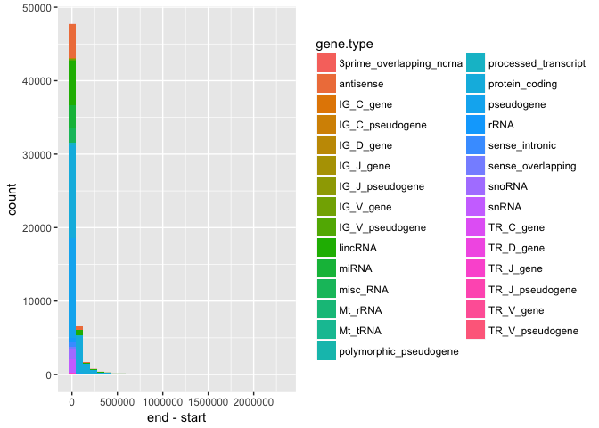
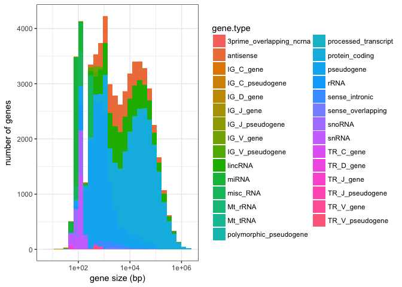
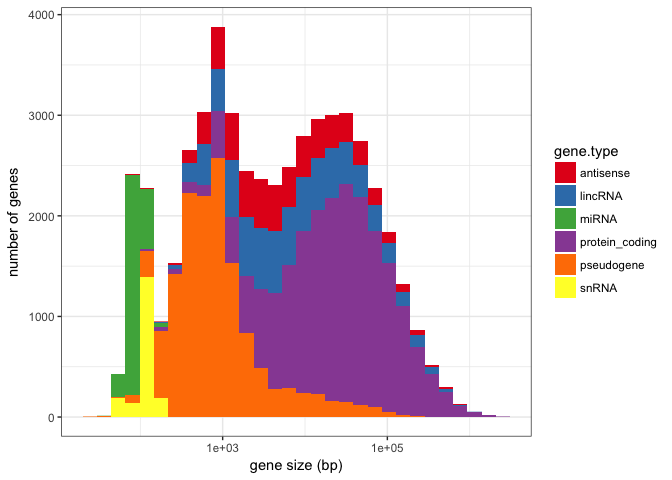
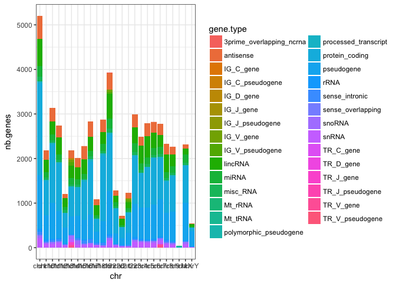
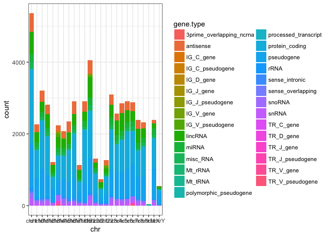
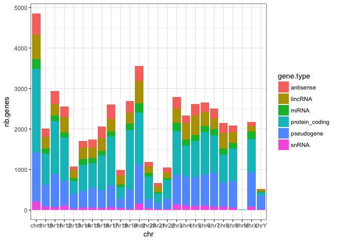
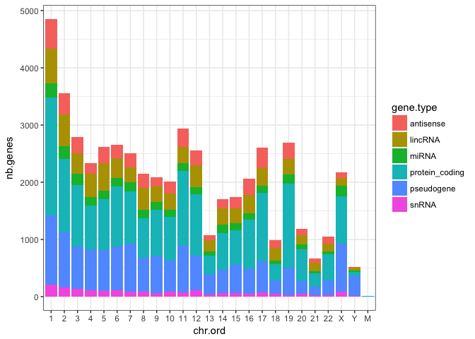
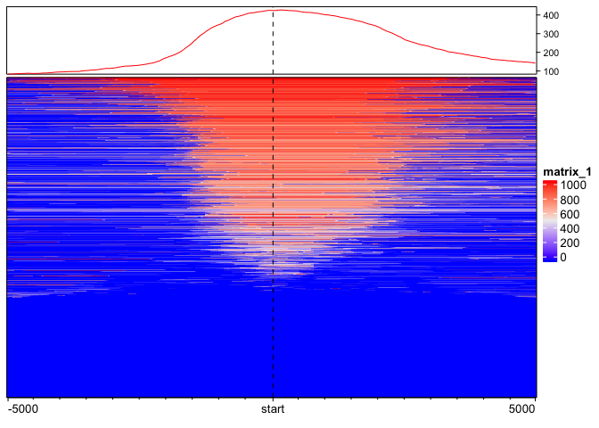
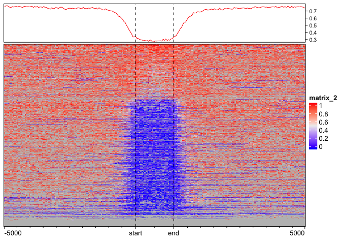
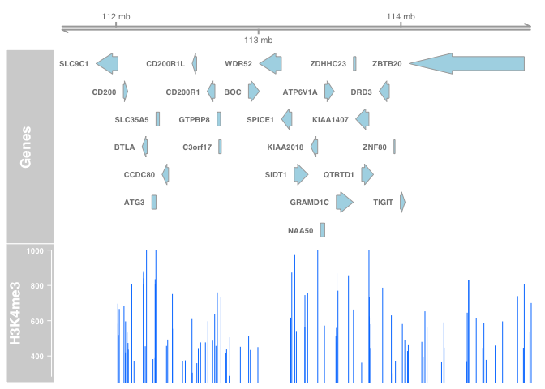

HGSS Workshop - Advanced R 2018 - Tidyverse and Bioconductor
================
Jean Monlong
March 26, 2018

R Markdown
----------

Maybe you don't realize yet, but R Markdown is awesome and you need it! I'll use it for today's workshop so that you can have a look at what it does and hopefully show you it's easy and useful.

This is an R Markdown document. Markdown is a simple formatting syntax for authoring HTML, PDF, and MS Word documents. For more details on using R Markdown see <http://rmarkdown.rstudio.com>. When you click the **Knit** button a document will be generated that includes both content as well as the output of any embedded R code chunks within the document.

Reading the Gencode file
------------------------

``` r
download.file('https://github.com/jmonlong/HGSS_Rworkshops/raw/master/Advanced-Tidyverse-Bioconductor-2018/gencodeForWorkshop.tsv.gz','gencodeForWorkshop.tsv.gz')

gc.df = read.table('gencodeForWorkshop.tsv.gz', header=TRUE, sep='\t', as.is=TRUE)

library(data.table)
```

    ## data.table 1.10.4.3

    ## **********
    ## This installation of data.table has not detected OpenMP support. It should still work but in single-threaded mode. If this is a Mac, please ensure you are using R>=3.4.0 and have installed the MacOS binary package from CRAN: see ?install.packages, the 'type=' argument and the 'Binary packages' section. If you compiled from source, please reinstall and precisely follow the installation instructions on the data.table homepage. This warning message should not occur on Windows or Linux. If it does and you've followed the installation instructions on the data.table homepage, please file a GitHub issue.
    ## **********

    ##   The fastest way to learn (by data.table authors): https://www.datacamp.com/courses/data-analysis-the-data-table-way

    ##   Documentation: ?data.table, example(data.table) and browseVignettes("data.table")

    ##   Release notes, videos and slides: http://r-datatable.com

``` r
gc.dt = fread('gunzip -c gencodeForWorkshop.tsv.gz')
gc.df = as.data.frame(gc.df)

head(gc.df)
```

    ##     chr     start       end strand    gene gene.type nb.exon
    ## 1 chr16  34977639  34990886      + 5S_rRNA   lincRNA      19
    ## 2 chr14  68123822  68123928      - 5S_rRNA      rRNA      19
    ## 3  chrX 147089620 147089735      - 5S_rRNA      rRNA      19
    ## 4  chrX  68892323  68892441      + 5S_rRNA      rRNA      19
    ## 5  chrX 150194767 150194878      - 5S_rRNA      rRNA      19
    ## 6 chr12  34358634  34358752      + 5S_rRNA      rRNA      19
    ##   exon.mean.size
    ## 1          202.8
    ## 2          202.8
    ## 3          202.8
    ## 4          202.8
    ## 5          202.8
    ## 6          202.8

Computing gene type summary
---------------------------

Now we want to compute, for each gene type:

-   the number of genes
-   the average gene size
-   the proportion of genes larger than 1 Kbp

### Example for one gene type

Let's practice with one gene type.

``` r
gc.pc = subset(gc.df, gene.type=='protein_coding')
nrow(gc.pc)
```

    ## [1] 20345

``` r
nb.genes = length(unique(gc.pc$gene))
gene.mean.size = mean(gc.pc$end - gc.pc$start)
gene.gt1kb = mean( (gc.pc$end - gc.pc$start) > 1000)
data.frame(gene.type='protein_coding', nb.genes =nb.genes, gene.mean.size=gene.mean.size, gene.gt1kb=gene.gt1kb)
```

    ##        gene.type nb.genes gene.mean.size gene.gt1kb
    ## 1 protein_coding    20242       65308.16  0.9694765

### Loop with `lapply` rather than `for`/`while` loops

Let's loop across gene types and bind the results into a *data.frame*:

``` r
gt.s = lapply(unique(gc.df$gene.type), function(gt){
  gc.pc = subset(gc.df, gene.type==gt)
  nb.genes = length(unique(gc.pc$gene))
  gene.mean.size = mean(gc.pc$end - gc.pc$start)
  gene.gt1kb = mean( (gc.pc$end - gc.pc$start) > 1000)
  data.frame(gene.type=gt, nb.genes =nb.genes, gene.mean.size=gene.mean.size, gene.gt1kb=gene.gt1kb)
})

gt.s = do.call(rbind, gt.s)
head(gt.s)
```

    ##        gene.type nb.genes gene.mean.size gene.gt1kb
    ## 1        lincRNA     7105     27983.5138  0.8591510
    ## 2           rRNA      521       112.0247  0.0000000
    ## 3       misc_RNA     1214       208.9872  0.0000000
    ## 4      antisense     5272     20951.8578  0.8428734
    ## 5 protein_coding    20242     65308.1610  0.9694765
    ## 6     pseudogene    13919      3580.5252  0.3470677

### Same with genes in chr Y

Subsetting the genes by gene type AND in chr Y.

``` r
gt.y.s = lapply(unique(gc.df$gene.type), function(gt){
  gc.pc = subset(gc.df, gene.type==gt & chr=='chrY')
  nb.genes = length(unique(gc.pc$gene))
  gene.mean.size = mean(gc.pc$end - gc.pc$start)
  gene.gt1kb = mean( (gc.pc$end - gc.pc$start) > 1000)
  data.frame(gene.type=gt, nb.genes =nb.genes, gene.mean.size=gene.mean.size, gene.gt1kb=gene.gt1kb)
})

gt.y.s = do.call(rbind, gt.y.s)
head(gt.y.s)
```

    ##        gene.type nb.genes gene.mean.size gene.gt1kb
    ## 1        lincRNA       53      20034.981  0.9622642
    ## 2           rRNA        8        120.000  0.0000000
    ## 3       misc_RNA        6        260.000  0.0000000
    ## 4      antisense       13      10787.615  0.9230769
    ## 5 protein_coding       72      52916.472  0.9305556
    ## 6     pseudogene      346       7226.821  0.7196532

### With functions

``` r
genetypeStats <- function(df){
  nb.genes = length(unique(df$gene))
  gene.mean.size = mean(df$end - df$start)
  gene.gt1kb = mean( (df$end - df$start) > 1000)
  data.frame(nb.genes =nb.genes, gene.mean.size=gene.mean.size, gene.gt1kb=gene.gt1kb)
}

## All genes
gt.s = lapply(unique(gc.df$gene.type), function(gt){
  data.frame(gene.type=gt, genetypeStats(subset(gc.df, gene.type==gt)))
})
gt.s = do.call(rbind, gt.s)
head(gt.s)
```

    ##        gene.type nb.genes gene.mean.size gene.gt1kb
    ## 1        lincRNA     7105     27983.5138  0.8591510
    ## 2           rRNA      521       112.0247  0.0000000
    ## 3       misc_RNA     1214       208.9872  0.0000000
    ## 4      antisense     5272     20951.8578  0.8428734
    ## 5 protein_coding    20242     65308.1610  0.9694765
    ## 6     pseudogene    13919      3580.5252  0.3470677

``` r
## Genes in Y
gt.y.s = lapply(unique(gc.df$gene.type), function(gt){
  data.frame(gene.type=gt, genetypeStats(subset(gc.df, gene.type==gt & chr=='chrY')))
})
gt.y.s = do.call(rbind, gt.y.s)
head(gt.y.s)
```

    ##        gene.type nb.genes gene.mean.size gene.gt1kb
    ## 1        lincRNA       53      20034.981  0.9622642
    ## 2           rRNA        8        120.000  0.0000000
    ## 3       misc_RNA        6        260.000  0.0000000
    ## 4      antisense       13      10787.615  0.9230769
    ## 5 protein_coding       72      52916.472  0.9305556
    ## 6     pseudogene      346       7226.821  0.7196532

### Parallelize

``` r
library(parallel)
gt.s = mclapply(unique(gc.df$gene.type), function(gt){
  data.frame(gene.type=gt, genetypeStats(subset(gc.df, gene.type==gt)))
}, mc.cores=2)
gt.s = do.call(rbind, gt.s)
head(gt.s)
```

    ##        gene.type nb.genes gene.mean.size gene.gt1kb
    ## 1        lincRNA     7105     27983.5138  0.8591510
    ## 2           rRNA      521       112.0247  0.0000000
    ## 3       misc_RNA     1214       208.9872  0.0000000
    ## 4      antisense     5272     20951.8578  0.8428734
    ## 5 protein_coding    20242     65308.1610  0.9694765
    ## 6     pseudogene    13919      3580.5252  0.3470677

### Pipes and *dplyr*

Now let's try using the grammar provided by [dplyr](http://dplyr.tidyverse.org/).

First, we want to show the top 10 genes with the most exons.

Without pipes or *dplyr* we could do:

``` r
head(gc.df[order(-gc.df$nb.exon),], 10)
```

    ##         chr     start       end strand    gene      gene.type nb.exon
    ## 54407  chr2 179390716 179695529      -     TTN protein_coding    1696
    ## 52380  chr6 152442819 152958936      -   SYNE1 protein_coding    1377
    ## 25073  chr2 152341850 152591001      -     NEB protein_coding    1225
    ## 8723  chr17  48638429  48704835      + CACNA1G protein_coding    1139
    ## 8712  chr12   2079952   2802108      + CACNA1C protein_coding    1098
    ## 21750  chr1  39546988  39952849      +   MACF1 protein_coding    1041
    ## 13989  chr6  56322785  56819426      -     DST protein_coding    1018
    ## 55925 chr14  51720651  51720741      -   Y_RNA       misc_RNA     809
    ## 55926  chr4  99094935  99095030      +   Y_RNA       misc_RNA     809
    ## 55927 chr21  18899458  18899565      -   Y_RNA       misc_RNA     809
    ##       exon.mean.size
    ## 54407          346.7
    ## 52380          192.7
    ## 25073          140.1
    ## 8723           195.3
    ## 8712           146.4
    ## 21750          216.8
    ## 13989          224.8
    ## 55925          106.8
    ## 55926          106.8
    ## 55927          106.8

With *dplyr*:

``` r
library(dplyr)
```

    ## 
    ## Attaching package: 'dplyr'

    ## The following objects are masked from 'package:data.table':
    ## 
    ##     between, first, last

    ## The following objects are masked from 'package:stats':
    ## 
    ##     filter, lag

    ## The following objects are masked from 'package:base':
    ## 
    ##     intersect, setdiff, setequal, union

``` r
gc.df %>% arrange(desc(nb.exon)) %>% head(10)
```

    ##      chr     start       end strand    gene      gene.type nb.exon
    ## 1   chr2 179390716 179695529      -     TTN protein_coding    1696
    ## 2   chr6 152442819 152958936      -   SYNE1 protein_coding    1377
    ## 3   chr2 152341850 152591001      -     NEB protein_coding    1225
    ## 4  chr17  48638429  48704835      + CACNA1G protein_coding    1139
    ## 5  chr12   2079952   2802108      + CACNA1C protein_coding    1098
    ## 6   chr1  39546988  39952849      +   MACF1 protein_coding    1041
    ## 7   chr6  56322785  56819426      -     DST protein_coding    1018
    ## 8  chr14  51720651  51720741      -   Y_RNA       misc_RNA     809
    ## 9   chr4  99094935  99095030      +   Y_RNA       misc_RNA     809
    ## 10 chr21  18899458  18899565      -   Y_RNA       misc_RNA     809
    ##    exon.mean.size
    ## 1           346.7
    ## 2           192.7
    ## 3           140.1
    ## 4           195.3
    ## 5           146.4
    ## 6           216.8
    ## 7           224.8
    ## 8           106.8
    ## 9           106.8
    ## 10          106.8

To compute the gene type stats using the function that we defined before we can use `group_by` and `do`:

``` r
gt.s = gc.df %>% group_by(gene.type) %>% do(genetypeStats(.)) %>% arrange(desc(nb.genes))
head(gt.s)
```

    ## # A tibble: 6 x 4
    ## # Groups:   gene.type [6]
    ##   gene.type      nb.genes gene.mean.size gene.gt1kb
    ##   <chr>             <int>          <dbl>      <dbl>
    ## 1 protein_coding    20242        65308        0.969
    ## 2 pseudogene        13919         3581        0.347
    ## 3 lincRNA            7105        27984        0.859
    ## 4 antisense          5272        20952        0.843
    ## 5 miRNA              3046           87.5      0    
    ## 6 snRNA              1903          108        0

``` r
gt.y.s = gc.df %>% filter(chr=='chrY') %>% group_by(gene.type) %>% do(genetypeStats(.)) %>% arrange(desc(nb.genes))
```

Let's try with `summarize` instead of the function.

``` r
gt.s = gc.df %>% group_by(gene.type) %>% summarize(nb.genes=length(unique(gene)), 
                                                   gene.mean.size=mean(end-start),
                                                   gene.gt1kb=mean((end-start)>1000))
gt.s %>% arrange(desc(nb.genes)) %>% head
```

### Graphs with *ggplot2*

``` r
library(ggplot2)
```

First, an histogram with the gene size distribution, colored by gene type.

``` r
ggplot(gc.df, aes(x=end-start, fill=gene.type)) + geom_histogram()
```

    ## `stat_bin()` using `bins = 30`. Pick better value with `binwidth`.



To make it a bit nicer, we can change the "theme", log10 scale the x-axis, rename the x-axis and y-axis.

``` r
ggplot(gc.df, aes(x=end-start, fill=gene.type)) + geom_histogram() + theme_bw() + scale_x_log10() + xlab('gene size (bp)') + ylab('number of genes')
```

    ## `stat_bin()` using `bins = 30`. Pick better value with `binwidth`.



We could also plot only the gene types with the most genes.

``` r
top.gt.s = gt.s %>% arrange(desc(nb.genes)) %>% head
gc.df %>% filter(gene.type %in% top.gt.s$gene.type) %>% ggplot(aes(x=end-start, fill=gene.type)) + geom_histogram() + theme_bw() + scale_x_log10() + xlab('gene size (bp)') + ylab('number of genes') + scale_fill_brewer(palette='Set1')
```

    ## `stat_bin()` using `bins = 30`. Pick better value with `binwidth`.



Now we want the number of genes per chromosome and gene type. First we need to prepare a *data.frame* with *dplyr*, then we'll plug it to `ggplot`.

``` r
gc.df %>% group_by(chr, gene.type) %>% summarize(nb.genes=length(unique(gene))) %>% ggplot( aes(x=chr, y=nb.genes, fill=gene.type)) + geom_bar(stat='identity') + theme_bw()
```



``` r
ggplot(gc.df, aes(x=chr, fill=gene.type)) + geom_bar() + theme_bw()
```



``` r
gc.df %>% filter(gene.type %in% top.gt.s$gene.type) %>% group_by(chr, gene.type) %>% summarize(nb.genes=length(unique(gene))) %>% ggplot( aes(x=chr, y=nb.genes, fill=gene.type)) + geom_bar(stat='identity') + theme_bw()
```



Changing chr names and order.

``` r
gc.df = gc.df %>% mutate(chr.ord=gsub('chr','', chr), chr.ord=factor(chr.ord, levels=c(1:22, 'X','Y','M')))
gc.df %>% filter(gene.type %in% top.gt.s$gene.type) %>% group_by(chr.ord, gene.type) %>% summarize(nb.genes=length(unique(gene))) %>% ggplot( aes(x=chr.ord, y=nb.genes, fill=gene.type)) + geom_bar(stat='identity') + theme_bw()
```



Bioconductor
------------

### GenomicRanges package

Creating and manipulating *GRanges*, an example with one region.

``` r
library(GenomicRanges)
```

    ## Loading required package: stats4

    ## Loading required package: BiocGenerics

    ## 
    ## Attaching package: 'BiocGenerics'

    ## The following objects are masked from 'package:dplyr':
    ## 
    ##     combine, intersect, setdiff, union

    ## The following objects are masked from 'package:parallel':
    ## 
    ##     clusterApply, clusterApplyLB, clusterCall, clusterEvalQ,
    ##     clusterExport, clusterMap, parApply, parCapply, parLapply,
    ##     parLapplyLB, parRapply, parSapply, parSapplyLB

    ## The following objects are masked from 'package:stats':
    ## 
    ##     IQR, mad, sd, var, xtabs

    ## The following objects are masked from 'package:base':
    ## 
    ##     anyDuplicated, append, as.data.frame, cbind, colMeans,
    ##     colnames, colSums, do.call, duplicated, eval, evalq, Filter,
    ##     Find, get, grep, grepl, intersect, is.unsorted, lapply,
    ##     lengths, Map, mapply, match, mget, order, paste, pmax,
    ##     pmax.int, pmin, pmin.int, Position, rank, rbind, Reduce,
    ##     rowMeans, rownames, rowSums, sapply, setdiff, sort, table,
    ##     tapply, union, unique, unsplit, which, which.max, which.min

    ## Loading required package: S4Vectors

    ## 
    ## Attaching package: 'S4Vectors'

    ## The following objects are masked from 'package:dplyr':
    ## 
    ##     first, rename

    ## The following objects are masked from 'package:data.table':
    ## 
    ##     first, second

    ## The following object is masked from 'package:base':
    ## 
    ##     expand.grid

    ## Loading required package: IRanges

    ## 
    ## Attaching package: 'IRanges'

    ## The following objects are masked from 'package:dplyr':
    ## 
    ##     collapse, desc, slice

    ## The following object is masked from 'package:data.table':
    ## 
    ##     shift

    ## Loading required package: GenomeInfoDb

``` r
gr = GRanges('chr1:103-404')
gr
```

    ## GRanges object with 1 range and 0 metadata columns:
    ##       seqnames     ranges strand
    ##          <Rle>  <IRanges>  <Rle>
    ##   [1]     chr1 [103, 404]      *
    ##   -------
    ##   seqinfo: 1 sequence from an unspecified genome; no seqlengths

``` r
width(gr)
```

    ## [1] 302

``` r
promoters(gr)
```

    ## Warning in .local(x, upstream, downstream, ...): '*' ranges were treated as
    ## '+'

    ## GRanges object with 1 range and 0 metadata columns:
    ##       seqnames       ranges strand
    ##          <Rle>    <IRanges>  <Rle>
    ##   [1]     chr1 [-1897, 302]      *
    ##   -------
    ##   seqinfo: 1 sequence from an unspecified genome; no seqlengths

To "convert" a *data.frame* into a *GRanges*, for example for protein coding genes in chr 1:

``` r
gc.chr1.pc.gr = makeGRangesFromDataFrame(subset(gc.df, gene.type=='protein_coding' & chr=='chr1'),keep.extra.columns=TRUE)
## or with pipes
gc.chr1.pc.gr = gc.df %>% filter(gene.type=='protein_coding', chr=='chr1') %>% makeGRangesFromDataFrame(keep.extra.columns=TRUE)
gc.chr1.pc.gr
```

    ## GRanges object with 2076 ranges and 5 metadata columns:
    ##          seqnames                 ranges strand |        gene
    ##             <Rle>              <IRanges>  <Rle> | <character>
    ##      [1]     chr1 [ 33772367,  33786699]      - |     A3GALT2
    ##      [2]     chr1 [ 12776118,  12788726]      + |     AADACL3
    ##      [3]     chr1 [ 12704566,  12727097]      + |     AADACL4
    ##      [4]     chr1 [ 94458393,  94586688]      - |       ABCA4
    ##      [5]     chr1 [229652329, 229694442]      - |      ABCB10
    ##      ...      ...                    ...    ... .         ...
    ##   [2072]     chr1   [33938246, 33962107]      + |     ZSCAN20
    ##   [2073]     chr1   [45482071, 45771881]      - |      ZSWIM5
    ##   [2074]     chr1   [53308183, 53360670]      + |      ZYG11A
    ##   [2075]     chr1   [53192126, 53293014]      + |      ZYG11B
    ##   [2076]     chr1   [78028101, 78149104]      - |        ZZZ3
    ##               gene.type   nb.exon exon.mean.size  chr.ord
    ##             <character> <integer>      <numeric> <factor>
    ##      [1] protein_coding         7          267.7        1
    ##      [2] protein_coding         7          726.1        1
    ##      [3] protein_coding         4          392.8        1
    ##      [4] protein_coding       117          141.5        1
    ##      [5] protein_coding        19          280.4        1
    ##      ...            ...       ...            ...      ...
    ##   [2072] protein_coding        16          471.5        1
    ##   [2073] protein_coding        17          364.2        1
    ##   [2074] protein_coding        27          310.5        1
    ##   [2075] protein_coding        40          316.8        1
    ##   [2076] protein_coding        78          257.9        1
    ##   -------
    ##   seqinfo: 1 sequence from an unspecified genome; no seqlengths

Now, we want to get the TSS location using the `promoters` function and defining the promoter region as the 1bp downstream of the TSS.

``` r
tss.gr = promoters(gc.chr1.pc.gr, upstream=0, downstream=1)
tss.gr
```

    ## GRanges object with 2076 ranges and 5 metadata columns:
    ##          seqnames                 ranges strand |        gene
    ##             <Rle>              <IRanges>  <Rle> | <character>
    ##      [1]     chr1 [ 33786699,  33786699]      - |     A3GALT2
    ##      [2]     chr1 [ 12776118,  12776118]      + |     AADACL3
    ##      [3]     chr1 [ 12704566,  12704566]      + |     AADACL4
    ##      [4]     chr1 [ 94586688,  94586688]      - |       ABCA4
    ##      [5]     chr1 [229694442, 229694442]      - |      ABCB10
    ##      ...      ...                    ...    ... .         ...
    ##   [2072]     chr1   [33938246, 33938246]      + |     ZSCAN20
    ##   [2073]     chr1   [45771881, 45771881]      - |      ZSWIM5
    ##   [2074]     chr1   [53308183, 53308183]      + |      ZYG11A
    ##   [2075]     chr1   [53192126, 53192126]      + |      ZYG11B
    ##   [2076]     chr1   [78149104, 78149104]      - |        ZZZ3
    ##               gene.type   nb.exon exon.mean.size  chr.ord
    ##             <character> <integer>      <numeric> <factor>
    ##      [1] protein_coding         7          267.7        1
    ##      [2] protein_coding         7          726.1        1
    ##      [3] protein_coding         4          392.8        1
    ##      [4] protein_coding       117          141.5        1
    ##      [5] protein_coding        19          280.4        1
    ##      ...            ...       ...            ...      ...
    ##   [2072] protein_coding        16          471.5        1
    ##   [2073] protein_coding        17          364.2        1
    ##   [2074] protein_coding        27          310.5        1
    ##   [2075] protein_coding        40          316.8        1
    ##   [2076] protein_coding        78          257.9        1
    ##   -------
    ##   seqinfo: 1 sequence from an unspecified genome; no seqlengths

### AnnotationHub

Using AnnotationHub we'll download histone mark data, CpG island location and methylation levels across the genome.

First, H3K4me3 peaks for Gm12878.

``` r
library(AnnotationHub)
ah = AnnotationHub()
```

    ## snapshotDate(): 2017-10-27

``` r
query(ah, c('H3K4me3', 'Gm12878', 'hg19'))
```

    ## AnnotationHub with 11 records
    ## # snapshotDate(): 2017-10-27 
    ## # $dataprovider: BroadInstitute, UCSC
    ## # $species: Homo sapiens
    ## # $rdataclass: GRanges, BigWigFile
    ## # additional mcols(): taxonomyid, genome, description,
    ## #   coordinate_1_based, maintainer, rdatadateadded, preparerclass,
    ## #   tags, rdatapath, sourceurl, sourcetype 
    ## # retrieve records with, e.g., 'object[["AH23256"]]' 
    ## 
    ##             title                                                      
    ##   AH23256 | wgEncodeBroadHistoneGm12878H3k4me3StdPk.broadPeak.gz       
    ##   AH27075 | wgEncodeUwHistoneGm12878H3k4me3StdHotspotsRep1.broadPeak.gz
    ##   AH27076 | wgEncodeUwHistoneGm12878H3k4me3StdHotspotsRep2.broadPeak.gz
    ##   AH27077 | wgEncodeUwHistoneGm12878H3k4me3StdPkRep1.narrowPeak.gz     
    ##   AH27078 | wgEncodeUwHistoneGm12878H3k4me3StdPkRep2.narrowPeak.gz     
    ##   ...       ...                                                        
    ##   AH30747 | E116-H3K4me3.narrowPeak.gz                                 
    ##   AH31690 | E116-H3K4me3.gappedPeak.gz                                 
    ##   AH32869 | E116-H3K4me3.fc.signal.bigwig                              
    ##   AH33901 | E116-H3K4me3.pval.signal.bigwig                            
    ##   AH40294 | E116-H3K4me3.imputed.pval.signal.bigwig

``` r
his.gr = ah[["AH23256"]]
```

    ## require("rtracklayer")

    ## loading from cache '/Users/jeanmonlong//.AnnotationHub/28684'

    ## 
    ## Attaching package: 'Biostrings'

    ## The following object is masked from 'package:base':
    ## 
    ##     strsplit

``` r
his.gr
```

    ## GRanges object with 57476 ranges and 5 metadata columns:
    ##           seqnames               ranges strand |        name     score
    ##              <Rle>            <IRanges>  <Rle> | <character> <numeric>
    ##       [1]    chr22 [16846081, 16871326]      * |        <NA>       442
    ##       [2]    chr22 [17305403, 17306803]      * |        <NA>       452
    ##       [3]    chr22 [17517009, 17517744]      * |        <NA>       566
    ##       [4]    chr22 [17518173, 17518768]      * |        <NA>       619
    ##       [5]    chr22 [17518988, 17520014]      * |        <NA>       651
    ##       ...      ...                  ...    ... .         ...       ...
    ##   [57472]    chr18 [77960842, 77960981]      * |        <NA>       812
    ##   [57473]    chr18 [77968309, 77968568]      * |        <NA>       619
    ##   [57474]    chr18 [77971224, 77971546]      * |        <NA>       748
    ##   [57475]    chr18 [78004912, 78005684]      * |        <NA>       559
    ##   [57476]    chr18 [78016426, 78016688]      * |        <NA>      1000
    ##           signalValue    pValue    qValue
    ##             <numeric> <numeric> <numeric>
    ##       [1]    5.684996      13.3        -1
    ##       [2]    5.930038      15.7        -1
    ##       [3]    8.506914      15.4        -1
    ##       [4]    9.697092      15.4        -1
    ##       [5]   10.434366      16.0        -1
    ##       ...         ...       ...       ...
    ##   [57472]   11.071379       3.2        -1
    ##   [57473]    7.664801       3.5        -1
    ##   [57474]    9.940248      11.9        -1
    ##   [57475]    6.588402      15.0        -1
    ##   [57476]   24.836934      15.4        -1
    ##   -------
    ##   seqinfo: 93 sequences (1 circular) from hg19 genome

Now, CpG islands and methylation.

``` r
query(ah, c('CpG', 'Islands', 'hg19'))
```

    ## AnnotationHub with 1 record
    ## # snapshotDate(): 2017-10-27 
    ## # names(): AH5086
    ## # $dataprovider: UCSC
    ## # $species: Homo sapiens
    ## # $rdataclass: GRanges
    ## # $rdatadateadded: 2013-03-26
    ## # $title: CpG Islands
    ## # $description: GRanges object from UCSC track 'CpG Islands'
    ## # $taxonomyid: 9606
    ## # $genome: hg19
    ## # $sourcetype: UCSC track
    ## # $sourceurl: rtracklayer://hgdownload.cse.ucsc.edu/goldenpath/hg19/dat...
    ## # $sourcesize: NA
    ## # $tags: c("cpgIslandExt", "UCSC", "track", "Gene", "Transcript",
    ## #   "Annotation") 
    ## # retrieve record with 'object[["AH5086"]]'

``` r
cpg.gr = ah[["AH5086"]]
```

    ## loading from cache '/Users/jeanmonlong//.AnnotationHub/5086'

``` r
cpg.gr
```

    ## GRanges object with 28691 ranges and 1 metadata column:
    ##                        seqnames           ranges strand |        name
    ##                           <Rle>        <IRanges>  <Rle> | <character>
    ##       [1]                  chr1 [ 28736,  29810]      * |    CpG:_116
    ##       [2]                  chr1 [135125, 135563]      * |     CpG:_30
    ##       [3]                  chr1 [327791, 328229]      * |     CpG:_29
    ##       [4]                  chr1 [437152, 438164]      * |     CpG:_84
    ##       [5]                  chr1 [449274, 450544]      * |     CpG:_99
    ##       ...                   ...              ...    ... .         ...
    ##   [28687]  chr9_gl000201_random [ 15651,  15909]      * |     CpG:_30
    ##   [28688]  chr9_gl000201_random [ 26397,  26873]      * |     CpG:_43
    ##   [28689] chr11_gl000202_random [ 16284,  16540]      * |     CpG:_23
    ##   [28690] chr17_gl000204_random [ 54686,  57368]      * |    CpG:_228
    ##   [28691] chr17_gl000205_random [117501, 117801]      * |     CpG:_23
    ##   -------
    ##   seqinfo: 93 sequences (1 circular) from hg19 genome

``` r
query(ah, c('methylation','WGBS', 'hg19'))
```

    ## AnnotationHub with 37 records
    ## # snapshotDate(): 2017-10-27 
    ## # $dataprovider: BroadInstitute
    ## # $species: Homo sapiens
    ## # $rdataclass: BigWigFile
    ## # additional mcols(): taxonomyid, genome, description,
    ## #   coordinate_1_based, maintainer, rdatadateadded, preparerclass,
    ## #   tags, rdatapath, sourceurl, sourcetype 
    ## # retrieve records with, e.g., 'object[["AH49492"]]' 
    ## 
    ##             title                                 
    ##   AH49492 | E003_WGBS_FractionalMethylation.bigwig
    ##   AH49493 | E004_WGBS_FractionalMethylation.bigwig
    ##   AH49494 | E005_WGBS_FractionalMethylation.bigwig
    ##   AH49495 | E006_WGBS_FractionalMethylation.bigwig
    ##   AH49496 | E007_WGBS_FractionalMethylation.bigwig
    ##   ...       ...                                   
    ##   AH49524 | E105_WGBS_FractionalMethylation.bigwig
    ##   AH49525 | E106_WGBS_FractionalMethylation.bigwig
    ##   AH49526 | E109_WGBS_FractionalMethylation.bigwig
    ##   AH49527 | E112_WGBS_FractionalMethylation.bigwig
    ##   AH49528 | E113_WGBS_FractionalMethylation.bigwig

``` r
meth.bw = ah[["AH49492"]]
```

    ## loading from cache '/Users/jeanmonlong//.AnnotationHub/56212'

``` r
meth.bw
```

    ## BigWigFile object
    ## resource: /Users/jeanmonlong//.AnnotationHub/56212

Expand CpG islands by 10 Kbp. We'll use this later to import and visualize methylation around CpG islands.

``` r
cpg.region.gr = resize(cpg.gr, width=width(cpg.gr)+1e4, fix='center')
```

    ## Warning in valid.GenomicRanges.seqinfo(x, suggest.trim = TRUE): GRanges object contains 13 out-of-bound ranges located on
    ##   sequences chr6_mcf_hap5, chr6_qbl_hap6, chrUn_gl000215,
    ##   chrUn_gl000220, chrUn_gl000225, chrUn_gl000229, chrUn_gl000231,
    ##   chrUn_gl000235, chrUn_gl000236, chrUn_gl000240, chrUn_gl000241,
    ##   chr1_gl000192_random, and chr9_gl000201_random. Note that only
    ##   ranges located on a non-circular sequence whose length is not NA
    ##   can be considered out-of-bound (use seqlengths() and isCircular()
    ##   to get the lengths and circularity flags of the underlying
    ##   sequences). You can use trim() to trim these ranges. See
    ##   ?`trim,GenomicRanges-method` for more information.

``` r
cpg.gr
```

    ## GRanges object with 28691 ranges and 1 metadata column:
    ##                        seqnames           ranges strand |        name
    ##                           <Rle>        <IRanges>  <Rle> | <character>
    ##       [1]                  chr1 [ 28736,  29810]      * |    CpG:_116
    ##       [2]                  chr1 [135125, 135563]      * |     CpG:_30
    ##       [3]                  chr1 [327791, 328229]      * |     CpG:_29
    ##       [4]                  chr1 [437152, 438164]      * |     CpG:_84
    ##       [5]                  chr1 [449274, 450544]      * |     CpG:_99
    ##       ...                   ...              ...    ... .         ...
    ##   [28687]  chr9_gl000201_random [ 15651,  15909]      * |     CpG:_30
    ##   [28688]  chr9_gl000201_random [ 26397,  26873]      * |     CpG:_43
    ##   [28689] chr11_gl000202_random [ 16284,  16540]      * |     CpG:_23
    ##   [28690] chr17_gl000204_random [ 54686,  57368]      * |    CpG:_228
    ##   [28691] chr17_gl000205_random [117501, 117801]      * |     CpG:_23
    ##   -------
    ##   seqinfo: 93 sequences (1 circular) from hg19 genome

``` r
cpg.region.gr
```

    ## GRanges object with 28691 ranges and 1 metadata column:
    ##                        seqnames           ranges strand |        name
    ##                           <Rle>        <IRanges>  <Rle> | <character>
    ##       [1]                  chr1 [ 23736,  34810]      * |    CpG:_116
    ##       [2]                  chr1 [130125, 140563]      * |     CpG:_30
    ##       [3]                  chr1 [322791, 333229]      * |     CpG:_29
    ##       [4]                  chr1 [432152, 443164]      * |     CpG:_84
    ##       [5]                  chr1 [444274, 455544]      * |     CpG:_99
    ##       ...                   ...              ...    ... .         ...
    ##   [28687]  chr9_gl000201_random [ 10651,  20909]      * |     CpG:_30
    ##   [28688]  chr9_gl000201_random [ 21397,  31873]      * |     CpG:_43
    ##   [28689] chr11_gl000202_random [ 11284,  21540]      * |     CpG:_23
    ##   [28690] chr17_gl000204_random [ 49686,  62368]      * |    CpG:_228
    ##   [28691] chr17_gl000205_random [112501, 122801]      * |     CpG:_23
    ##   -------
    ##   seqinfo: 93 sequences (1 circular) from hg19 genome

Select 1000 random CpG islands

``` r
cpg.1k.gr = cpg.gr[sample.int(length(cpg.gr), 1000)]
cpg.region.1k.gr = resize(cpg.1k.gr, width=width(cpg.1k.gr)+1e4, fix='center')
```

    ## Warning in valid.GenomicRanges.seqinfo(x, suggest.trim = TRUE): GRanges object contains 1 out-of-bound range located on sequence
    ##   chr9_gl000201_random. Note that only ranges located on a
    ##   non-circular sequence whose length is not NA can be considered
    ##   out-of-bound (use seqlengths() and isCircular() to get the lengths
    ##   and circularity flags of the underlying sequences). You can use
    ##   trim() to trim these ranges. See ?`trim,GenomicRanges-method` for
    ##   more information.

Now we can import the methylation data in these regions:

``` r
meth.bw
```

    ## BigWigFile object
    ## resource: /Users/jeanmonlong//.AnnotationHub/56212

``` r
meth.gr = import(meth.bw, which=cpg.region.1k.gr)
```

    ## Warning in .local(con, format, text, ...): 'which' contains seqlevels
    ## not known to BigWig file: chr1_gl000191_random, chr1_gl000192_random,
    ## chr4_ctg9_hap1, chr4_gl000193_random, chr4_gl000194_random, chr6_apd_hap1,
    ## chr6_cox_hap2, chr6_dbb_hap3, chr6_mann_hap4, chr6_mcf_hap5,
    ## chr6_qbl_hap6, chr6_ssto_hap7, chr7_gl000195_random, chr8_gl000196_random,
    ## chr8_gl000197_random, chr9_gl000198_random, chr9_gl000199_random,
    ## chr9_gl000200_random, chr9_gl000201_random, chr11_gl000202_random,
    ## chr17_ctg5_hap1, chr17_gl000203_random, chr17_gl000204_random,
    ## chr17_gl000205_random, chr17_gl000206_random, chr18_gl000207_random,
    ## chr19_gl000208_random, chr19_gl000209_random, chr21_gl000210_random,
    ## chrUn_gl000211, chrUn_gl000212, chrUn_gl000213, chrUn_gl000214,
    ## chrUn_gl000215, chrUn_gl000216, chrUn_gl000217, chrUn_gl000218,
    ## chrUn_gl000219, chrUn_gl000220, chrUn_gl000221, chrUn_gl000222,
    ## chrUn_gl000223, chrUn_gl000224, chrUn_gl000225, chrUn_gl000226,
    ## chrUn_gl000227, chrUn_gl000228, chrUn_gl000229, chrUn_gl000230,
    ## chrUn_gl000231, chrUn_gl000232, chrUn_gl000233, chrUn_gl000234,
    ## chrUn_gl000235, chrUn_gl000236, chrUn_gl000237, chrUn_gl000238,
    ## chrUn_gl000239, chrUn_gl000240, chrUn_gl000241, chrUn_gl000242,
    ## chrUn_gl000243, chrUn_gl000244, chrUn_gl000245, chrUn_gl000246,
    ## chrUn_gl000247, chrUn_gl000248, chrUn_gl000249

``` r
meth.gr
```

    ## GRanges object with 439443 ranges and 1 metadata column:
    ##            seqnames               ranges strand |             score
    ##               <Rle>            <IRanges>  <Rle> |         <numeric>
    ##        [1]     chr1     [989460, 989460]      * | 0.790000021457672
    ##        [2]     chr1     [989461, 989461]      * | 0.790000021457672
    ##        [3]     chr1     [989477, 989477]      * | 0.779999971389771
    ##        [4]     chr1     [989478, 989478]      * | 0.779999971389771
    ##        [5]     chr1     [989543, 989543]      * | 0.810000002384186
    ##        ...      ...                  ...    ... .               ...
    ##   [439439]     chrY [26354561, 26354561]      * |              0.75
    ##   [439440]     chrY [26354566, 26354566]      * |              0.75
    ##   [439441]     chrY [26354567, 26354567]      * |              0.75
    ##   [439442]     chrY [26355437, 26355437]      * |                 1
    ##   [439443]     chrY [26355438, 26355438]      * |                 1
    ##   -------
    ##   seqinfo: 25 sequences from an unspecified genome

### Heatmaps

We want to represent the histone mark location in relation to the TSS. Then we'll represent the methylation in and around CpG islands.

``` r
library(EnrichedHeatmap)
```

    ## Loading required package: grid

    ## Loading required package: ComplexHeatmap

    ## ========================================
    ## ComplexHeatmap version 1.17.1
    ## Bioconductor page: http://bioconductor.org/packages/ComplexHeatmap/
    ## Github page: https://github.com/jokergoo/ComplexHeatmap
    ## Documentation: http://bioconductor.org/packages/ComplexHeatmap/
    ## 
    ## If you use it in published research, please cite:
    ## Gu, Z. Complex heatmaps reveal patterns and correlations in multidimensional 
    ##   genomic data. Bioinformatics 2016.
    ## ========================================

    ## ========================================
    ## EnrichedHeatmap version 1.9.3
    ## Bioconductor page: http://bioconductor.org/packages/EnrichedHeatmap/
    ## Github page: https://github.com/jokergoo/EnrichedHeatmap
    ## Documentation: http://bioconductor.org/packages/EnrichedHeatmap/
    ## ========================================

    ## 
    ## Attaching package: 'EnrichedHeatmap'

    ## The following object is masked from 'package:ComplexHeatmap':
    ## 
    ##     +.AdditiveUnit

``` r
mathm = normalizeToMatrix(his.gr, tss.gr, value_column = "score", extend = 5000, mean_mode = "w0", w = 50)
EnrichedHeatmap(mathm)
```



``` r
mathm2 = normalizeToMatrix(meth.gr, cpg.1k.gr, value_column = "score", mean_mode = "absolute", extend = 5000, w = 50, background = NA)
EnrichedHeatmap(mathm2)
```



### Overlapping regions

For each gene type, how many genes overlap an H3K4me3 histone mark in Gm12878 ?

``` r
gene.his = lapply(unique(gc.df$gene.type), function(gt){
  gt.gr = makeGRangesFromDataFrame(subset(gc.df, gene.type==gt))
  gt.gr = subsetByOverlaps(gt.gr, his.gr)
  data.frame(gene.type=gt, nb.genes.his=length(gt.gr))
})
gene.his = do.call(rbind, gene.his)
head(gene.his)
```

    ##        gene.type nb.genes.his
    ## 1        lincRNA         1898
    ## 2           rRNA           33
    ## 3       misc_RNA          182
    ## 4      antisense         2389
    ## 5 protein_coding        14983
    ## 6     pseudogene         1104

Here we performed an overlap for each gene type. In my experience it's more efficient to do one overlap and then further analysis (if possible). For example, we could first select genes that overlap and then count how many there are for each gene type.

``` r
gc.gr = makeGRangesFromDataFrame(gc.df, keep.extra.columns = TRUE)
gc.his.gr = subsetByOverlaps(gc.gr, his.gr)
gc.his.gr
```

    ## GRanges object with 22084 ranges and 5 metadata columns:
    ##           seqnames                 ranges strand |        gene
    ##              <Rle>              <IRanges>  <Rle> | <character>
    ##       [1]    chr13 [ 45697228,  45697549]      + |         7SK
    ##       [2]     chr5 [ 68266266,  68325992]      - |         7SK
    ##       [3]     chr8 [144624280, 144624570]      + |         7SK
    ##       [4]    chr19 [ 58856544,  58864865]      - |        A1BG
    ##       [5]    chr19 [ 58859117,  58866549]      + |    A1BG-AS1
    ##       ...      ...                    ...    ... .         ...
    ##   [22080]     chr1 [ 53308183,  53360670]      + |      ZYG11A
    ##   [22081]     chr1 [ 53192126,  53293014]      + |      ZYG11B
    ##   [22082]     chr7 [143078173, 143088204]      + |         ZYX
    ##   [22083]    chr17 [  3907739,   4046314]      - |       ZZEF1
    ##   [22084]     chr1 [ 78028101,  78149104]      - |        ZZZ3
    ##                gene.type   nb.exon exon.mean.size  chr.ord
    ##              <character> <integer>      <numeric> <factor>
    ##       [1]       misc_RNA        20          383.3       13
    ##       [2]        lincRNA        20          383.3        5
    ##       [3]      antisense        20          383.3        8
    ##       [4] protein_coding        24          313.5       19
    ##       [5]      antisense        22          367.7       19
    ##       ...            ...       ...            ...      ...
    ##   [22080] protein_coding        27          310.5        1
    ##   [22081] protein_coding        40          316.8        1
    ##   [22082] protein_coding        60          227.7        7
    ##   [22083] protein_coding       146          208.8       17
    ##   [22084] protein_coding        78          257.9        1
    ##   -------
    ##   seqinfo: 25 sequences from an unspecified genome; no seqlengths

``` r
gc.his.gr %>% as.data.frame %>% group_by(gene.type) %>% summarize(nb.genes.his=n())
```

    ## # A tibble: 27 x 2
    ##    gene.type                nb.genes.his
    ##    <chr>                           <int>
    ##  1 3prime_overlapping_ncrna            7
    ##  2 antisense                        2389
    ##  3 IG_C_gene                           4
    ##  4 IG_C_pseudogene                     1
    ##  5 IG_D_gene                           7
    ##  6 IG_J_gene                           9
    ##  7 IG_J_pseudogene                     2
    ##  8 IG_V_gene                          16
    ##  9 IG_V_pseudogene                    16
    ## 10 lincRNA                          1898
    ## # ... with 17 more rows

We can do the same with the `findOverlaps`. In this example, it's a bit of an overkill but many time you need more than what `subsetByOverlaps`/`countOverlaps` functions can provide.

``` r
ol = findOverlaps(gc.gr, his.gr)
ol
```

    ## Hits object with 56324 hits and 0 metadata columns:
    ##           queryHits subjectHits
    ##           <integer>   <integer>
    ##       [1]         8       20407
    ##       [2]        11       38591
    ##       [3]        14       48007
    ##       [4]        15        8524
    ##       [5]        16        8524
    ##       ...       ...         ...
    ##   [56320]     57819        1472
    ##   [56321]     57819        1473
    ##   [56322]     57820       11544
    ##   [56323]     57820       11545
    ##   [56324]     57820       11546
    ##   -------
    ##   queryLength: 57820 / subjectLength: 57476

``` r
ol %>% as.data.frame %>% mutate(gene.type=gc.gr$gene.type[queryHits]) %>% group_by(gene.type) %>% summarize(nb.genes.his=n())
```

    ## # A tibble: 27 x 2
    ##    gene.type                nb.genes.his
    ##    <chr>                           <int>
    ##  1 3prime_overlapping_ncrna            8
    ##  2 antisense                        4112
    ##  3 IG_C_gene                           5
    ##  4 IG_C_pseudogene                     1
    ##  5 IG_D_gene                           7
    ##  6 IG_J_gene                           9
    ##  7 IG_J_pseudogene                     2
    ##  8 IG_V_gene                          16
    ##  9 IG_V_pseudogene                    16
    ## 10 lincRNA                          3369
    ## # ... with 17 more rows

### GO enrichment

We want to test for GO enrichment in the protein-coding genes overlapping histone peaks with a score higher than 900.

``` r
genes.his900.gr = gc.df %>% filter(gene.type=='protein_coding') %>% makeGRangesFromDataFrame(keep.extra.columns=TRUE) %>% subsetByOverlaps(subset(his.gr, score>900))
genes.his900 = genes.his900.gr$gene
head(genes.his900)
```

    ## [1] "A4GALT" "AACS"   "AAK1"   "AAR2"   "AARS"   "AARS2"

``` r
library(clusterProfiler)
```

    ## Loading required package: DOSE

    ## 

    ## Warning: replacing previous import 'Matrix::cov2cor' by 'stats::cov2cor'
    ## when loading 'igraph'

    ## Warning: replacing previous import 'Matrix::toeplitz' by 'stats::toeplitz'
    ## when loading 'igraph'

    ## Warning: replacing previous import 'Matrix::update' by 'stats::update' when
    ## loading 'igraph'

    ## Warning: replacing previous import 'Matrix::tail' by 'utils::tail' when
    ## loading 'igraph'

    ## Warning: replacing previous import 'Matrix::head' by 'utils::head' when
    ## loading 'igraph'

    ## DOSE v3.4.0  For help: https://guangchuangyu.github.io/DOSE
    ## 
    ## If you use DOSE in published research, please cite:
    ## Guangchuang Yu, Li-Gen Wang, Guang-Rong Yan, Qing-Yu He. DOSE: an R/Bioconductor package for Disease Ontology Semantic and Enrichment analysis. Bioinformatics 2015, 31(4):608-609

    ## clusterProfiler v3.6.0  For help: https://guangchuangyu.github.io/clusterProfiler
    ## 
    ## If you use clusterProfiler in published research, please cite:
    ## Guangchuang Yu., Li-Gen Wang, Yanyan Han, Qing-Yu He. clusterProfiler: an R package for comparing biological themes among gene clusters. OMICS: A Journal of Integrative Biology. 2012, 16(5):284-287.

``` r
all.pc.genes = subset(gc.df, gene.type=='protein_coding')$gene
## go.enr = enrichGO(gene=genes.his900 , 'org.Hs.eg.db', ont="BP", universe=all.pc.genes , readable=TRUE, keyType = 'SYMBOL')
```

When we try to use the gene names we get a non-helpful error. I'm not sure what is wrong. To avoid errors, we might want to convert the gene names (symbols) to Entrez IDs beforehands.

``` r
conv.df <- bitr(all.pc.genes , fromType = "SYMBOL", toType = c("ENTREZID"),
OrgDb = 'org.Hs.eg.db')
```

    ## Loading required package: org.Hs.eg.db

    ## Loading required package: AnnotationDbi

    ## Loading required package: Biobase

    ## Welcome to Bioconductor
    ## 
    ##     Vignettes contain introductory material; view with
    ##     'browseVignettes()'. To cite Bioconductor, see
    ##     'citation("Biobase")', and for packages 'citation("pkgname")'.

    ## 
    ## Attaching package: 'Biobase'

    ## The following object is masked from 'package:AnnotationHub':
    ## 
    ##     cache

    ## 
    ## Attaching package: 'AnnotationDbi'

    ## The following object is masked from 'package:dplyr':
    ## 
    ##     select

    ## 

    ## 'select()' returned 1:many mapping between keys and columns

    ## Warning in bitr(all.pc.genes, fromType = "SYMBOL", toType =
    ## c("ENTREZID"), : 8.72% of input gene IDs are fail to map...

``` r
head(conv.df)
```

    ##    SYMBOL ENTREZID
    ## 1    A1BG        1
    ## 2    A1CF    29974
    ## 3     A2M        2
    ## 4   A2ML1   144568
    ## 5 A3GALT2   127550
    ## 6  A4GALT    53947

``` r
symbolToEntrez = conv.df$ENTREZID 
names(symbolToEntrez) = conv.df$SYMBOL

go.enr = enrichGO(gene=symbolToEntrez[genes.his900] , 'org.Hs.eg.db', ont="BP", universe=symbolToEntrez[all.pc.genes] , readable=TRUE)
```

Now it worked. Let's have a look at the top 10 enriched GO.

``` r
go.enr.s = as.data.frame(go.enr) 
head(go.enr.s[,c("Description","GeneRatio","qvalue")],10)
```

    ##                                                               Description
    ## GO:0022613                           ribonucleoprotein complex biogenesis
    ## GO:0042254                                            ribosome biogenesis
    ## GO:0016072                                         rRNA metabolic process
    ## GO:0034470                                               ncRNA processing
    ## GO:0006364                                                rRNA processing
    ## GO:0070972                  protein localization to endoplasmic reticulum
    ## GO:0072599 establishment of protein localization to endoplasmic reticulum
    ## GO:0006402                                         mRNA catabolic process
    ## GO:0045047                                        protein targeting to ER
    ## GO:0000956                     nuclear-transcribed mRNA catabolic process
    ##            GeneRatio       qvalue
    ## GO:0022613  199/3269 3.875351e-29
    ## GO:0042254  149/3269 1.652740e-25
    ## GO:0016072  137/3269 7.289597e-25
    ## GO:0034470  169/3269 7.700014e-24
    ## GO:0006364  123/3269 6.594333e-23
    ## GO:0070972   77/3269 2.211315e-21
    ## GO:0072599   68/3269 5.152092e-21
    ## GO:0006402  146/3269 5.388631e-20
    ## GO:0045047   65/3269 6.263339e-20
    ## GO:0000956  103/3269 7.256456e-20

### Gviz

The [Gviz](https://bioconductor.org/packages/release/bioc/vignettes/Gviz/inst/doc/Gviz.pdf) package provides functions to display several information/tracks in a region.

For example, let's visualize the gene location and histone mark score in a region from chr 3.

``` r
library(Gviz)

region.gr = GRanges('chr3:112e6-115e6')
gatrack = GenomeAxisTrack()

genes.reg = gc.df %>% filter(gene.type=='protein_coding') %>% makeGRangesFromDataFrame(keep.extra.columns=TRUE) %>% subsetByOverlaps(region.gr)
gene.t = AnnotationTrack(range=genes.reg, name = "Genes", group=genes.reg$gene)

his.t = his.gr %>% subsetByOverlaps(region.gr) %>% DataTrack(data="score", type='h', name="H3K4me3")

plotTracks(list(gatrack, gene.t, his.t), showId=TRUE)
```


